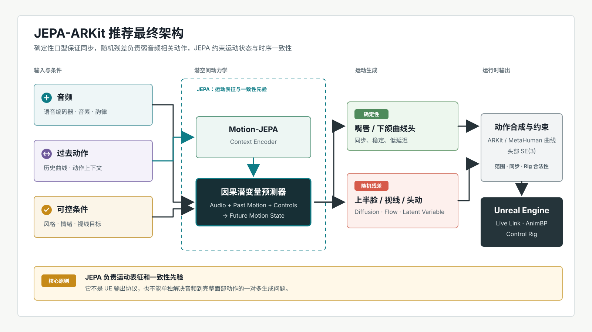

# JEPA-ARKit：从传统 Audio2Face 基线到潜空间世界模型的研究与实验路线

> 状态：研究与实施草案 v1.2（一期范围、双轨与核心契约已冻结）<br>
> 更新日期：2026-08-12<br>
> 目标读者：研究、训练、数据、UE/技术美术团队

## 0. 执行摘要

本项目的目标不是“复现 V-JEPA”，而是构建一个能在 Unreal Engine 中实际消费的语音驱动面部动画系统，并验证 JEPA 是否能在运动先验、低标签训练和跨身份泛化上带来可测量收益。

最保险的研发顺序是：

1. 先建立可渲染、可量化、可与商业工具比较的 ARKit/MetaHuman 传统基线。
2. 用直接回归和区域解耦建立一期的强、可解释对照。
3. 只在运动曲线上预训练 Motion-JEPA，先证明表征有效，再接入音频。
4. 用 JEPA 重构传统基线的“运动编码器/未来预测器”，保留显式 UE 曲线解码头。
5. 只有核心结论成立且有剩余预算时，才把 VQ、扩散、随机残差、视觉教师作为条件扩展。

推荐的最终形态是：



核心原则：JEPA 是运动表征和一致性先验，不是输出协议，也不是解决一对多生成问题的充分条件。

### 0.1 启动约束

- **产品边界**：数据和 checkpoint 采用“研究轨/产品轨”双轨治理。非商业、用途不明或衍生模型权利不明确的数据只能进入隔离研究轨，不能进入产品候选 checkpoint。
- **计算边界**：所有必做实验必须能在单张 24 GB GPU 上运行。WavLM Large、HuBERT Large 和视觉教师只能使用预计算冻结特征；联合训练大型编码器不属于第一阶段交付。
- **UE 基线**：生产验收锁定 Unreal Engine 5.6.x。Gate 0 记录确切 patch、MetaHuman 版本、插件清单和资产 hash；任何升级都必须重跑导入、渲染、实时和重定向测试。
- **证据边界**：许可证、商业工具能力和 UE 插件接口必须以启动时保存的官方条款或本地验证结果为准。无法核实的项目标记为“待核验”，并阻断对应产品路径。
- **第一阶段语言**：英语为训练和主测试语言；其他语言仅作为许可合规的 language-disjoint 泛化测试，不假设任何候选数据集天然包含特定语言。
- **一期实验上限**：必做核心实验只有 E00、E01、E02、E03、E10、E11；一期结束时至多四个候选进入三 seed 正式比较：E01、E03、E11 和一个由预注册触发条件选出的备选。E04、E05、E12、E13、E14 与 E20 产品验收均不构成一期完成条件。

---

## 1. 范围与成功定义

### 1.1 第一阶段范围

- 输入：16 kHz 单声道语音，可选情绪、风格和视线控制。
- 输出：版本化的 ARKit 兼容曲线集合，以及独立的头部旋转和平移。
- 动画频率：模型统一输出 30 fps。UE 60 fps 播放时，曲线默认线性插值，头部旋转使用四元数 SLERP，头部平移使用线性插值；可选单调三次曲线插值必须先通过无过冲检查。
- 首先支持离线生成，再验证带有限 look-ahead 的流式生成；模型只传输 30 fps 原始曲线，60 fps 插值固定在 UE 消费端执行，不改变模型输出协议。
- 首个角色目标为 MetaHuman，同时保留对其他 ARKit 兼容角色的重定向能力。

流式协议由 E02 一次性冻结，至少包含：16 kHz 输入、30 fps 输出、音频 chunk 大小、look-ahead、overlap、状态缓存上限、首帧时间戳定义和尾段 flush 规则。所有后续模型必须复用该协议；look-ahead 表示等待真实未来音频，不得记为零延迟。30 fps 原始输出和 60 fps 重采样输出都必须保存并报告差异。

### 1.2 不在第一阶段承诺的内容

- 不承诺仅靠音频唯一确定眨眼、视线、眉毛和头动。
- 不把 ARKit 曲线等同于 MetaHuman 骨骼或完整 Control Rig 控制空间。
- 不在传统基线完成前训练通用视频基础模型。
- 不以训练损失或 ARKit 系数误差单独判断动画质量。

### 1.3 成功必须同时满足

- 嘴形与语音同步不弱于强直接回归基线。
- 上半脸和头动的统计真实性、多样性优于确定性基线。
- 未见身份、未见语音和野外音频上的核心指标退化不超过预注册的 2% 非劣界。
- 动画可以在统一 MetaHuman 场景中直接播放、编辑和复用。
- JEPA 的增益能在等参数、等数据、等训练预算下复现。

### 1.4 四个一等问题与启动顺序

本项目的主风险不是“尚未选择最终网络”，而是以下四条必须各自闭环的工作流。它们按依赖顺序推进：数据决定可学习上限，模型决定可表达目标，训练决定结论是否可信，适配决定输出是否能成为完整数字人资产的一部分。任何一条未通过就绪门，都不得用增加模型规模掩盖问题。

| 主线 | 要回答的关键问题 | 必交付物 | 就绪门 |
|---|---|---|---|
| 数据 | 哪些音频-动作样本可用于监督，标签误差和分布缺口在哪里？ | 可追溯数据集、质量审计、split、数据卡和冻结特征 | D0A/D0B |
| 模型 | 什么状态可由语音确定、什么必须条件化或随机化，输出如何独立于角色 rig？ | canonical motion contract、强直接基线、模型比较矩阵 | M0 |
| 训练 | 每一个性能差异是否来自模型，而非采样、泄漏、预算或优化偶然性？ | 预注册配置、可恢复训练、诊断面板和复现实验 | T0 |
| 适配 | 同一动画如何可靠驱动不同面部与完整数字人资产，而不把角色差异学习进模型？ | character profile、rig adapter、UE 验收场景和回归渲染 | A0 |

执行顺序为 `D0A 候选数据 -> M0 + T0 基础设施 smoke -> E00 -> D0B/Gate 0 冻结 release -> E01 -> E02（协议冻结）-> E03 -> E10 -> E11 -> A0`。E04/E05 仅在 E03 未满足预注册的上半脸自然度或多样性目标时二选一触发；E12 是 E10 内部的条件消融，E13 只在 E11 通过但多样性仍不足时触发；E14 与 E20 属于第二阶段候选。M0 和 T0 可使用合成数据与隔离的最小候选样本并行准备，但不得产生可比较 checkpoint；E01 必须等待 D0B、M0、T0 全部通过；E02 是 E03/E10/E11 的硬前置；A0 可与 E01 并行，但不影响数据和模型研究结论。

#### 数据主线：D0A/D0B 数据就绪门

数据集不是“视频经过求解器后的 npz 集合”，而是版本化、可复核的多模态观测集。每个 clip 必须保留原始媒体不可变指纹、音视频时间轴、求解器原始输出、平滑输出、质量证据和权限轨；平滑后的曲线是一个派生标签版本，不能覆盖原始观测。

**数据工作包**：

1. 建立来源注册表和数据卡：记录说话人/身份数、语言、情绪、镜头、姿态、遮挡、录音链路、许可、同意范围、已知偏差和产品轨资格。
2. 固定求解与同步管线：输入解码参数、MediaPipe/其他求解器版本、脸部选择规则、时间戳插值、丢帧处理、平滑参数、曲线裁剪与头部坐标系必须全部写入配置和数据指纹。
3. 建立质量标注集：200 段 E00 审计样本以外，再固定 50 段不参与规则设计的 holdout；并从合格样本中人工精修 2--3 小时 Gold 锚点。按身份、情绪、姿态、遮挡和发音强度分层，报告严重失败率、每类失败率、标注一致性、说话人级可用率和过滤后的分布漂移。
4. 输出 `dataset_card.md`、`quality_report.parquet`、`split_manifest.jsonl`、`label_policy.yaml` 与 `data_release.json`。`data_release.json` 固定来源、过滤、特征、权限、统计和已知限制，训练只能引用 release ID。
5. 训练集、验证集、主测试集、野外测试集和感知测试集必须在特征提取前冻结；同一原视频、音频重编码、裁剪、镜像、增强副本和同一撤回键均不能跨 split。验证集至少包含 5 个身份；达不到时使用预注册的三组 repeated identity holdout 做筛选，主测试集始终封存。
6. 特征缓存必须按样本寻址，保存 `sample_id -> withdrawal_key -> cache shard/row` 索引；撤回时重写受影响 shard、创建新 feature release，并使旧 release 与其 checkpoint 不再可被产品轨加载。

**D0A 候选门**：来源、许可候选分类、原始媒体指纹、预注册指标、候选 split 和撤回索引均已建立，足以运行 E00；此时只能生成 `candidate` release，不能训练正式模型。

**D0B/Gate 0 冻结门**：研究轨和产品轨的正式 release 分离；每个 split 均无身份/说话人/来源/撤回键泄漏；Gold/Silver 通过 E00 的严重失败与标注一致性门槛；说话人级可用率、各质量桶和 Gold 锚点误差均已报告。40% 上限只适用于身份/来源；情绪、姿态与录音条件保留原生分布并由采样器补偿，不因凑均衡而丢弃多数样本。撤回演练必须覆盖特征 shard 重写。D0B 未通过时只允许修数据，不允许启动 E01 正式比较或 JEPA 预训练。

#### 模型主线：M0 目标与表示就绪门

模型必须先围绕可辨识性分解，而非围绕 JEPA 命名。模型只预测角色无关的 canonical face motion；角色特有的 blendshape、关节、材质和 body rig 均由适配层处理。语音强约束的 `mouth_jaw` 走确定性路径；弱约束的 `eyes_brows`、`gaze` 和 `head` 走显式条件或随机残差路径。没有可用 style/emotion/gaze 控制时，模型必须显式暴露“不确定”，而不是把随机性伪装为确定性标签误差。

**M0 固定接口**：

```text
audio [16 kHz waveform] -> frozen feature extractor -> audio_features [Ta, Da]
history [Tp, canonical motion] + audio_features + optional controls
  -> causal state predictor
  -> deterministic canonical motion [Tf, K + 7]
  -> optional stochastic residual for non-verbal groups
canonical motion + character_profile -> rig adapter -> UE curves / facial rig controls
```

- `canonical motion` 是唯一可由研究模型写出的动画空间：版本化 `curve_names`、单位、范围、头部局部坐标系和 neutral 定义必须固定；不得直接训练某个 MetaHuman 的私有 Control Rig 名称。
- `character_profile` 只包含身份无关模型不应学习的内容：目标 schema、曲线映射、neutral offset、范围、左右镜像规则、头颈连接约束、LOD/版本和质量状态。它不得包含音频或帧级目标动画。
- 所有候选共享音频特征版本、窗口、streaming 协议、输出空间、数据 release 与总参数预算。输出头可以随生成范式变化，但必须输出相同 canonical schema，并把 head/decoder 参数计入总预算；相对 E01 总参数量偏差超过 20% 必须预注册并单列比较。
- E01 是模型锚点而非一次性 baseline：只在 E01 通过音频依赖与范围检查、E02 通过长 rollout 和 30->60 fps 回归后，E03/E04/E05/E10/E11 才能改变架构。

**M0 通过条件**：canonical schema 可无损写入/读回；MediaPipe 名 -> canonical 名 -> UE 名的双向映射与降级策略已冻结；确定性与随机通道分组已冻结为 `mouth_jaw=确定性`、`eyes_brows=随机残差`、`gaze=外部条件或随机残差`、`head=确定性加随机残差`；直接基线在合成/隔离样本上完成单 batch 过拟合、固定 clip 收敛、audio-shuffle/静音/历史反转降级和 30 秒 rollout 六项 smoke；每个候选可在等预算下替换 E01 的 motion module。M0 smoke 产物带 `non_comparable=true`，不能进入结果表。否则问题属于表示或接口，不能解释为 JEPA 失败。

#### 训练主线：T0 训练可信度门

训练配置是实验协议的一部分。每个 run 必须定义数据 release、split、特征版本、窗口采样、增强、参数初始化、优化器、学习率调度、梯度裁剪、混合精度、有效 batch、更新步数、early stopping、随机 seed 和 checkpoint 选择规则。任何未记录的默认值均视为不可复现实验。

**T0 训练控制面**：

1. 采样器按 `source_id`、身份、情绪、录音条件、数据层级和质量桶分层；默认每 batch 至少 4 个身份、单身份不超过 30%、单一来源不超过 25%。小样本情绪不得因身份平衡而无限过采样，实际重复率和有效样本量必须记录。
2. 每次训练同时保存 step 级训练损失、各语义组验证指标、梯度范数、学习率、吞吐、峰值显存、NaN/Inf 次数、曲线越界率、latent effective rank 和 audio-shuffle 控制结果。
3. 训练分三级：`smoke` 为 1k updates，验证 I/O/数值/过拟合；`screening` 为 20k updates 单 seed；`comparison` 才允许三 seed 与冻结 test。screening 结果不得用于反复挑选 test checkpoint。
4. checkpoint 必须同时保存模型、EMA、优化器、调度器、RNG、sampler 状态、resolved config 和 data release ID；中断恢复后在固定 100-step trace 上与连续运行误差一致。
5. 训练增强分为数据增强与评测扰动：前者只能在 clean E01 已冻结后作为独立消融加入，后者永不进入训练标签。所有 loss 权重改变都要重跑与 E01 等预算对照。
6. 一期核心实验默认只使用 Gold + Silver；Bronze 以 20%/50%/100% 三档渐进加入。样本级曲线损失可使用归一化的 `tracking_confidence * av_sync_confidence` 权重，但“质量加权采样”和“置信度加权损失”必须分别消融，不能同时开启后归因。默认层级采样权重 Gold/Silver/Bronze 为 1.0/0.8/0.5；任一档使主指标退化超过 2% 即停止扩大。

**T0 通过条件**：同 seed 重跑 1k-step trace 的损失和参数 hash 一致；中断恢复与连续运行在固定验证集上差异不超过数值容差；训练/验证曲线、audio-shuffle、最差样本和资源报告可自动生成；任何 NaN、范围失控、数据泄漏或恢复不一致均阻断 comparison 阶段。

#### 适配主线：A0 完整数字人适配门

适配包含三件不同的事，必须分开度量：**人物适配**（新说话人的 style/neutral 小样本校准）、**rig 适配**（canonical motion 到角色控制空间）和**运行时适配**（离线/Live Link/AnimBP 的 UE 消费）。全身数字人是 rig 适配的接收对象，不是第一阶段模型新增的全身预测目标；面部模型输出只能影响面部、头部和头颈连接约束，身体由已有动画、行为系统或后续独立全身模块驱动。

**A0 角色契约**：

```json
{
  "character_profile_id": "mh_female_a_v1",
  "engine": {"version": "5.6.x", "metahuman_version": "locked"},
  "engine_compatibility": ["5.6.exact_patch"],
  "canonical_schema": "arkit_mediapipe_v1",
  "target_control_space": "arkit_curves_or_verified_rig_adapter",
  "curve_map_version": "v1",
  "supported_canonical_curves": ["..."],
  "degraded_curves": {"canonical_name": "zero|derived|nearest"},
  "neutral_pose_asset": "asset_hash",
  "head_neck_constraint": "asset_hash",
  "lod_policy": "asset_hash",
  "validation_scene": "asset_hash"
}
```

- 适配器输入是 canonical 曲线、头部变换、时间戳与 profile；输出必须可回读为同一时间轴上的目标控制值，并记录未映射/裁剪/饱和曲线。对可表达的 canonical 子空间执行 forward -> target -> projection-back 一致性检查；对低覆盖角色不伪造全维可逆性，而是在 profile 中冻结支持子集和 `zero/derived/nearest` 降级策略。
- 一个角色适配器不得改写研究模型权重。人物小样本校准只训练 M0 所定义的 adapter/输出仿射层，严格与主测试身份分离。
- 验收集固定为两个 MetaHuman、一个约 80% canonical 覆盖率的非 MetaHuman ARKit 角色和一个完整全身 MetaHuman。完整全身角色仅验证面部驱动与头颈、身体动画、镜头切换同时播放时的稳定性，不训练或评测语音到肢体动作。
- UE 5.8 的 Mesh to MetaHuman 仅作为潜在数字人创建工作流优化；无标记动捕属于独立全身输入，不属于本项目核心路径。只有经本地验证的新面部接口、RigLogic/OpenRigLogic 能力或自动化工具才登记为 `integration_candidate`。UE 5.8 移植是一期后的独立工程，必须维护独立 profile 并重跑 A0，不替换 UE 5.6.x 基线结论。

**A0 通过条件**：四个固定角色均能通过 commandlet/Python 自动导入；完整角色曲线映射覆盖率 100%，低覆盖角色每个缺失项均有显式降级；支持子空间 projection-back Huber 相对输入幅度不超过 1%；neutral、范围、左右映射、头颈连接和 UE 端 30->60 fps 重采样的回归渲染无新增失败；10 分钟全身角色场景中面部驱动不产生头颈跳变、NaN、曲线丢失或与身体动画的明显时间漂移。若低覆盖角色相对完整角色的感知评分下降超过 0.5/7，则该角色不通过且产品声明适用范围。A0 未通过时只修改 profile/adapter/UE 管线，不回调模型优劣结论。

---

## 2. 从传统方法继承什么

| 方法 | 已验证的经验 | 在本项目中的对应实验 |
|---|---|---|
| VOCA [1] | 身份、说话风格和动作应解耦；小型高质量 4D 数据仍然有价值 | 身份不相交划分、显式 style embedding、干净锚点集 |
| MeshTalk [2] | 音频相关嘴部动作和音频无关上半脸动作应分开建模 | 确定性嘴部头 + 随机上半脸先验 |
| FaceFormer [3] | 长音频上下文、因果注意力和自监督语音特征能提高连续语音建模 | 强因果 Transformer 基线、look-ahead 消融 |
| CodeTalker [4] | 离散运动先验能缓解直接回归的均值化 | VQ 运动先验基线，不能在实验前排除 |
| EMOTE [5] | 口型是局部高频信号，情绪是全脸低频信号，应使用不同时间尺度和监督 | 分区域、分频段损失；情绪序列级监督 |
| FaceDiffuser [6] | 非语言面部线索具有随机性；blendshape 管线可以直接训练扩散模型 | 上半脸/头动条件扩散基线 |
| DiffPoseTalk [7] | 风格参考和头动需要显式生成与控制 | style reference encoder、头部 SE(3) 独立建模 |
| AutoFaceARKit [8] | MediaPipe 伪标签可快速建立 UE 基线，但噪声和抖动会显著限制感知质量 | 先做标签审计；用同一 UE 场景比较研究模型和商业工具 |

传统方法给出的共识比“选哪种网络”更重要：

1. 嘴部、上半脸、视线和头动不是同一个条件分布。
2. 音频到完整面部动作是一对多问题。
3. 数据表示和求解质量经常比模型结构更决定最终观感。
4. 系数误差、同步、自然度和表现力必须分别评估。

### 2.1 一个特别相关的 2026 基线

AutoFaceARKit [8] 已经完成了与本项目高度相似的传统路线：

- 将 MEAD 的 47 名说话人视频经 MediaPipe 转成 ARKit 兼容曲线。
- 因明显噪声和时序抖动，最终只保留 24 名说话人。
- 重训 FaceDiffuser-ARKit 和 ProbTalk3DX-ARKit。
- 通过 Python 后端生成 CSV，再由 UE 的 LiveLinkFaceImporter 转成动画资产。
- 在统一 MetaHuman 渲染条件下与 Epic MetaHuman 音频动画和 NVIDIA Audio2Face 比较。
- 用户研究采用 7 点量表，分别评价 Lip-Sync、Realism 和 Expressiveness，每组 30 名以上参与者。

该工作中 Epic 和 NVIDIA 仍明显领先研究模型，作者将主要差距归因于高质量专有数据、角色专用控制空间和模型优化。这说明第一个工程目标应是建立同等级的评测闭环，而不是直接扩大伪标签规模。

在本计划的 2026-08-11 文献快照中，其项目页尚未提供公开代码入口，因此本文把它作为方法和评测协议基线，不把它视为可直接安装的依赖。

上述 24/47 是外部工作的说话人筛选结果，不等同于本项目 E00 的 clip 级严重失败率。D0B 必须同时报告 clip 级失败率、说话人级可用率和来源整体剔除率，不能把不同统计单位直接比较。

---

## 3. JEPA 最新进展的可迁移部分

### 3.1 V-JEPA 到 V-JEPA 2

原始 V-JEPA [9] 使用时空 multi-block masking，在 EMA 目标编码器的连续潜空间中预测被遮罩视频块。它主要证明了 masked latent prediction 可以学习强视频表征，并不等同于纯 `past -> future` 生成。

V-JEPA 2 [10] 明确分为两个阶段：

1. 在超过一百万小时视频/图像上做 action-free masked latent pretraining。
2. 冻结视觉编码器，用不到 62 小时机器人数据训练 block-causal、action-conditioned predictor，即 V-JEPA 2-AC。

对本项目最重要的启示是“先学动作状态，再学条件转移”，而不是复制其视频模型规模。

### 3.2 V-JEPA 2.1

V-JEPA 2.1 [11][12] 的主要改进是：

- Dense Predictive Loss：可见 token 和被遮罩 token 都接受监督。
- Deep Self-Supervision：在多个中间层施加预测目标。
- 图像和视频使用模态专用 tokenizer，共享主干。
- 通过数据、模型扩展和蒸馏提高密集局部特征与时序一致性。

迁移到 ARKit 曲线时，不应照搬图像 patch，而应把嘴、眼/眉、视线、头部定义为语义 token 组，并验证“全 token 监督”和“深层监督”是否改善局部动态。

### 3.3 Audio-JEPA、AV-JEPA 与 JEPA-WAM

- Audio-JEPA [13] 证明 masked spectrogram latent prediction 可以学习音频表征，但没有证明它优于面向语音运动对齐的 WavLM/HuBERT。
- AV-JEPA [14] 使用早期音视频融合、modality dropout 和 SIGReg 做跨模态对齐；目前主要证据是分类和检索，而不是帧级动画生成。
- JEPA-WAM [15] 展示了 latent transition prediction 与连续动作输出放入共享 predictor 的相似设计意图；它只作为相关工作，不是 E11 的直接架构依据。

证据等级需要区分：V-JEPA 2.1 有 Meta 官方实现和模型；Audio-JEPA、AV-JEPA、JEPA-WAM 等较新结果仍应按预印本和早期代码对待。它们适合提供待验证的设计假设，不应直接成为产品架构承诺。

### 3.4 本项目不应提出的论断

- 连续潜空间不会自动消除平均脸；L2 的最优解仍是条件均值。
- Stop-gradient 单独不能防止坍塌；V-JEPA 使用 EMA teacher、非对称 predictor 和 stop-gradient 的组合。
- JEPA 可能主动忽略不可预测细节，因此弱音频相关动作仍需要随机变量或额外控制。
- V-JEPA 2.1 的密集视觉特征提升，不能直接推出低维曲线预测提升。

---

## 4. 统一数据契约

先稳定数据契约，再比较模型。所有传统模型和 JEPA 模型必须读取同一 manifest，并输出同一动画格式。

### 4.1 单条样本

```json
{
  "clip_id": "source/subject/session/utterance",
  "audio_path": "audio/clip.wav",
  "motion_path": "motion/clip.npz",
  "motion_label_version": "solver_raw_v1|release_default_v1|gold_refined_v1",
  "preprocessing_pipeline": "pipeline_id_and_hash",
  "source_id": "dataset_or_video_id",
  "speaker_id": "speaker_001",
  "face_identity_id": "face_001",
  "language": "en",
  "recording_condition": "studio_clean",
  "rights_profile_id": "rights_mead_research_v1",
  "withdrawal_key": "subject_or_consent_record_id",
  "fps": 30,
  "sample_rate": 16000,
  "curve_schema": "arkit_mediapipe_v1",
  "emotion": "neutral",
  "emotion_intensity": 0.0,
  "style_id": null,
  "sync_offset_ms": 0,
  "quality": {
    "face_visibility": 0.98,
    "tracking_confidence": 0.95,
    "av_sync_confidence": 0.91,
    "motion_jitter_score": 0.08
  },
  "split": "train"
}
```

### 4.2 `motion.npz`

```text
curves:            float32 [T, K]
curve_names:       string  [K]
head_quaternion:   float32 [T, 4]
head_translation:  float32 [T, 3]
frame_confidence:  float32 [T]
curve_confidence:  float32 [T, K]   # 可选
timestamps:        float64 [T]
```

不要只把接口称为“52 维 ARKit”。不同求解器可能包含或排除 neutral、tongue、头部曲线，Epic 文档也以 51 个面部姿态描述 Face AR 输入 [16]。真正的契约应是版本化的 `curve_names` 列表。

`motion.npz` 的 `curve_names` 必须使用 M0 冻结的 canonical 名，不得直接保存求解器或 UE 私有名称。每个 clip 同时保留 raw 和派生标签的引用关系；一个 release 只能指定一个 `release_default` 监督版本，其完整滤波参数、输入 label hash 和输出 label hash 写入 `preprocessing_pipeline`。E00 盲评确定默认链，E01 仍以固定子集做 raw/default 消融；训练代码不得按样本静默混用预处理链。

### 4.3 语义分组

- `mouth_jaw`：嘴唇、口角、下颌、脸颊鼓起等语音高相关曲线。
- `eyes_brows`：眨眼、眼睑、眉毛。
- `gaze`：眼球方向；如果求解器不能稳定提供，应单独降权或移除。
- `nose_cheek`：鼻翼、脸颊等表情曲线。
- `head`：四元数旋转和平移，不与 `[0,1]` 曲线共用损失尺度。

语义分组同时用于 tokenizer、损失权重、指标和随机残差分支。

### 4.4 数据层级

| 层级 | 建议规模 | 用途 |
|---|---:|---|
| Gold | 2–10 小时高质量捕捉或人工复核 | 标签上限、UE 验收、模型选择 |
| Silver | 20–100 小时受控正面视频伪标签 | 主基线训练、稳定消融 |
| Bronze | 100–500 小时多来源伪标签 | 泛化和鲁棒性验证 |
| Web-scale | 通过全部决策门后再扩展 | JEPA 自监督和长尾覆盖 |

数量只是起点。任何扩展都必须报告“过滤前/后时长、身份数、平均置信度和被剔除原因”。

训练按层级渐进：核心基线先使用 Gold + Silver；Bronze 仅按 T0 的 20%/50%/100% 阶梯加入。Gold 不通过全量过采样弥补规模，必须在模型选择和标签上限评估中保持独立权重；Bronze 造成主指标超过 2% 退化时停止加入。

### 4.5 划分与泄漏控制

- 训练、验证、测试按脸部身份和说话人双重不相交。
- 同一原视频、同一音频片段及其裁剪不能跨 split。
- 额外保留 source-disjoint 的野外测试集。
- Gold 集不能用于大规模超参数搜索。
- 固定一个 20–40 条音频的 UE 感知测试集，所有模型使用相同角色、相机、灯光和音量。
- language-disjoint 只在 D0A 找到许可合规且每种语言至少 30 条、说话人与英语 split 不相交的固定测试集时启用；报告相对英语测试的退化。没有合格数据时必须明确写“仅验证英语”，不得事后挑选外语样本，也不得把“退化不超过 5%”作为虚构的必过门槛。

### 4.6 权限注册与双轨隔离

每个 `rights_profile_id` 必须指向版本化权限注册表，至少记录：来源、许可文本或授权证据 hash、允许的研究用途、允许的商业训练用途、衍生模型与生成内容权利、再分发限制、撤回/删除流程、负责人和最近复核日期。

- 研究轨可以使用明确允许研究但不允许商业使用的数据；产出的 checkpoint 和特征缓存必须带 `research_only=true`，不得进入产品比较或部署。
- 产品轨只接受可商用、自录且取得充分同意，或另有书面授权的数据。许可不明等同于不可进入产品轨。
- 同一实验混用两轨数据时只能形成研究结论，不能通过移除文件名或元数据将模型追溯状态改为产品可用。
- `train` 和 `load_checkpoint` 必须接收 `track`，并验证 data release、feature release、checkpoint 祖先和所有 `rights_profile_id` 的轨道兼容性；产品轨加载任何研究轨权重（包括 encoder 预训练权重）必须硬失败并留下审计事件。
- 研究轨最优架构进入产品轨时只能迁移代码、配置和已公开的结构选择，必须在产品轨合格数据上从允许的初始化重新训练；产品性能另行验收。产品数据不足时，一期结论必须明确限定为研究结论，不能用研究 checkpoint 代替 E20 产品验收。
- 删除请求通过 `withdrawal_key` 定位原始样本、派生标签、特征 shard、split 和受影响 checkpoint；删除演练必须在 Gate 0 完成一次，并使旧 release/checkpoint 在 registry 中变为 revoked。
- 本方案不将 voice conversion、面部模糊或生成式替换作为唯一匿名化措施。去标识方案需按适用司法辖区单独完成隐私评估，并保留数据最小化、访问审计和重识别风险测试。

Gate 0 前必须冻结 `data_licensing_matrix.csv`，逐项列出 MEAD、VOCA/VOCASET、自录数据和其他候选来源的许可证据、研究轨资格、产品轨资格、权重可否继承、生成内容限制和公开 benchmark 限制。这里不预判任何数据集可商用；未获得并保存官方许可文本的单元格一律为 `unverified/block`。

产品轨转化协议固定为：`研究轨架构选择 -> 清除研究权重和特征 -> 仅使用产品轨允许初始化与数据重训 -> 独立产品测试 -> E20/A0 验收`。自动化策略引擎同时检查 release ancestry，不能依赖文件名、目录或人工承诺实现隔离。

### 4.7 存储与数据版本

每个数据版本必须报告原始媒体、动作标签、冻结特征、渲染缓存和 checkpoint 的实际占用，以及未来一个完整实验轮次的预计增量；容量计划统一增加 30% 余量。WavLM Base/Large 和 HuBERT Large 分别按帧率、维度、dtype 与 shard 开销计算，不用模糊的“几十 GB”估计。数据指纹同时覆盖 manifest、曲线 schema、过滤规则、权限注册表和特征提取配置，不能只记录文件列表。

### 4.8 导出 provenance 契约

所有离线/实时导出都生成同名 `provenance_sidecar.json`，并在 UE 资产 metadata 中保存不可缺失的关联字段：

```json
{
  "model_checkpoint_hash": "sha256:...",
  "training_data_release_id": "release_v1",
  "feature_release_id": "wavlm_base_fp16_v1",
  "rights_profile_ids": ["rights_product_recorded_v1"],
  "track": "research|product",
  "inference_date": "2026-08-12T10:00:00Z",
  "inference_environment_hash": "sha256:...",
  "curve_schema_version": "arkit_canonical_v1",
  "character_profile_id": "mh_female_a_v1",
  "export_pipeline_version": "v1.0",
  "ue_engine_compatibility": ["5.6.exact_patch"]
}
```

资产回读必须能从 metadata 追溯到 training release、权限档案和 checkpoint registry；缺字段或哈希不匹配时，产品轨导入硬失败。

---

## 5. 统一评测协议

### 5.1 客观指标

不使用单一总分；每个候选必须通过以下 Pareto 门槛。

| 维度 | 指标 |
|---|---|
| 曲线精度 | 全脸、嘴部、眼眉、视线分别计算 confidence-weighted MAE/Huber |
| 动态 | 一阶速度、二阶加速度、jerk；速度/加速度分布的 Wasserstein 距离 |
| 同步 | 嘴部系数与音素/viseme 对齐；在统一渲染上使用经校准的 AV-sync 模型 |
| 自然度 | 眨眼频率与持续时间、头动频谱、左右不对称统计、曲线越界率 |
| 分布 | 使用独立冻结 motion encoder 计算 FDD/Frechet distance |
| 多样性 | 同一音频多次采样的上半脸/头动距离，同时约束嘴部变化 |
| 条件有效性 | 音频打乱、静音、上下文打乱后的性能下降幅度 |
| 工程 | RTF、p50/p95 延迟、显存、参数量、UE 导入失败率 |

所有运动指标同时在 ARKit 系数空间和统一 MetaHuman 渲染空间检查。不同曲线组合可能产生相近几何结果，只看系数误差会误判。

在 D0A 开始任何规则设计或打开 E00 渲染结果前，预注册每个 Gate 的一个主指标和最多三个次指标。默认主指标为：Gate 1/3 使用统一渲染上的 AV-sync error，Gate 2 使用 0.5 秒未来动作 probe 的 confidence-weighted Huber，条件 E13 使用上半脸/头部样本间距离，二期 Gate 6 使用感知评测的 Lip-Sync 与 Realism 两个共同主终点。Gate 0 只校准默认 AV-sync 指标；若校准失败，则按预注册回退到 confidence-weighted mouth Huber，不允许看候选模型结果后换指标。

- 客观差值按身份和 clip 两级分层 bootstrap，报告 95% CI；默认 10,000 次重采样。
- Holm 校正只应用于每个 Gate 预注册的主要终点族；次指标报告效应量、原始 95% CI 和未校正 p 值，不参与事后筛选。预注册非劣界统一为 2% 相对退化，除非量纲要求在 D0A 前登记绝对界。
- “优越”要求方向正确且主要终点校正后的 95% CI 不跨 0；“严格非劣”要求 CI 的最差端不越过 2% 界。点估计退化小于 1% 但 CI 因功效不足越界时只能标记“工程可接受、统计不确定”，不能算 Gate 通过或等价。
- Gate 采用主指标优先的 Pareto 规则：主指标必须满足该 Gate 的优越/非劣条件；次指标用于说明收益类型与风险，不允许把多个维度合成未预注册总分。Pareto 前沿可保留多个候选，但一期三 seed 候选总数仍不得超过四个。
- FDD 的 motion encoder 必须在候选模型之外的数据上训练并冻结，记录训练数据、架构、checkpoint hash 和特征归一化；没有满足该条件的 encoder 时，FDD 只能作为探索指标。
- AV-sync 模型必须固定版本，并在内部正负偏移集上报告 ROC-AUC、偏移误差和失效分组；校准不合格时不得作为 Gate 主指标。

### 5.2 感知评测

复用 AutoFaceARKit [8] 的基本设计：

- 7 点 Likert：Lip-Sync、Realism、Expressiveness。
- 同一刺激增加研究模型与对照的配对 A/B 偏好；相对商业工具的可用性参考线为研究模型选择率不低于 40%，它不替代客观主指标，也不等于商业等价。
- 受试者内随机顺序，隐藏模型名称。
- 插入明显音画错配的 attention check。
- 研究阶段先用 12 名内部参与者完成 pilot；正式研究通过 pilot 的方差与刺激效应做模拟功效分析，样本量取 `max(48, 达到 80% 功效所需人数)`，最多招募 96 名有效参与者。
- attention check 失败的参与者从主分析完全排除；招募量按 pilot 失败率上浮，默认预留 20%。pilot 通过率低于 70% 时先修订 check，不得靠事后放宽排除规则补样本。
- 最小重要差异预注册为 7 点量表 0.35 分；正式研究若在 96 人上仍达不到 80% 功效，结论记为“不确定”。
- 每位参与者最多评价 12 个试次，其中 2 个为 attention check，总时长不超过 20 分钟；模型/刺激使用平衡不完全区组分配并随机化顺序，降低疲劳和顺序效应。
- 纳入标准为成年人、正常或矫正后正常视力、可正常听取测试音频并通过两个 attention check；分别记录动画/技术美术专业背景，作为预注册协变量而非事后筛选条件。
- 主分析使用包含 participant 与 stimulus 随机截距、必要时包含随机斜率的线性混合模型，并报告效应量、95% CI 和 Holm 校正结果。repeated-measures ANOVA 仅作为模型收敛失败时的备选分析。
- A/B 中所有模型使用同一角色、音频、相机、灯光、帧率和后处理。

### 5.3 运行纪律

- 筛选实验可先跑 1 个 seed；进入比较表的模型必须跑 3 个 seed。
- 报告最好、均值和标准差，不能只选最好 checkpoint。
- 参数量、有效 batch、更新步数和看到的总音频小时数必须匹配。
- 训练日志必须记录数据版本、曲线 schema、音频特征版本和 Git revision。
- 任何 Gate 的阈值、主指标、排除规则和分析脚本必须在打开 test 结果前冻结；变更需要形成带日期的偏差说明。

---

## 6. 递进实验

### E00：ARKit 伪标签与 UE 闭环审计

**目的**：在训练前确定标签上限，避免模型学习求解器抖动。

**数据**：从受控视频随机抽取至少 200 段，覆盖身份、情绪、侧脸、遮挡和强弱发音。

**标注指南**：严重失败定义为任何会使片段无法用于监督或统一渲染验收的问题，包括持续嘴唇穿插/分离错误、连续跟踪丢失、关键发音口型缺失、眨眼漏检或假眨眼、视线越界、静止段可见抖动、明显音画偏移及头部变换跳变。两个标注者独立判断；分歧由第三人裁决。

**步骤**：

1. 使用固定版本的 MediaPipe Face Landmarker [17] 生成曲线、landmark 和变换矩阵。
2. 保留未平滑原始输出，另产生轻度 Savitzky-Golay/One Euro 平滑版本。
3. 把两种版本导入统一 MetaHuman 场景并盲评；基于预注册的抖动、峰值保持、AV-sync 和感知规则选择唯一 `release_default` 链。
4. 统计跟踪丢失、曲线越界、静止段抖动、眨眼漏检和音画偏移。
5. 人工标记失败原因，形成自动过滤规则。

**对照**：原始曲线、平滑曲线、Epic 单目/音频求解结果（可用时）。

**通过门槛**：

- Gold/Silver 严重失败率点估计低于 5%，Wilson 95% CI 上界低于 8%。
- 双人标注 Cohen's kappa 不低于 0.80；低于阈值时先修订指南并重标 50 段校准集。
- 静止段抖动的 p95 被记录并进入后续损失/指标。
- 2--3 小时人工精修 Gold 锚点已完成；raw/default 相对精修标签的误差与感知差距均已报告，且每个说话人超过 80% 样本合格时才计为说话人级可用。
- UE 5.6.x commandlet/Python 批量生成 Animation/Level Sequence 成功率为 100%，曲线名无静默丢失。
- 数据撤回演练可以从 `withdrawal_key` 定位原始样本及全部派生产物，并生成可审计报告。

**停止条件**：如果伪标签渲染本身不自然，或说话人级可用率低于 60%，先修求解和过滤，不进入模型比较；低于 50% 时不得把该来源作为主训练源。若 E01 在精修 Gold 上仍相对合法可用的商业锚点落后至少 1.5/7 感知分，停止扩大模型并转为标签质量专项。该比较只在许可允许时进行。

### E01：最小确定性直接回归基线

**目的**：得到最难被 JEPA 超越的低复杂度基线。

**固定设置**：

- 16 kHz 音频，默认预计算冻结的 WavLM Base 特征。
- 30 fps 动作，4 秒窗口；音频和动作通过时间戳对齐。
- 2 层 temporal convolution + 6 层 causal Transformer，`d_model=256`。
- 输出 `K` 条曲线以及独立头部四元数/平移头。
- 初始损失：`1.0 * Huber(curve) + 0.5 * velocity + 0.1 * acceleration + 0.2 * head + 0.05 * range + lambda_sync * L_sync`。
- `head` 使用符号不变的四元数测地旋转损失和独立的平移 Huber，不能直接对四元数分量做普通 MSE。
- acceleration 在训练稳定后再 warm-in，避免早期只学平滑。

**消融**：

- 音频 look-ahead：0/80/160 ms。
- 无历史动作 vs. 1 秒历史动作。
- WavLM frozen vs. 仅微调最后 2 层。
- 在相同 E01 预测头、数据、更新步数和流式协议下，对比 WavLM Base、WavLM Large 与 HuBERT Large 的冻结特征；Large 模型只允许离线预计算特征。
- 统一权重 vs. mouth/eyes 分组权重。
- raw 标签 vs. E00 冻结的 `release_default` 标签；质量加权采样 vs. 均匀采样；置信度加权损失 vs. 统一损失。

`L_sync` 在 M0 固定为版本化 viseme 辅助损失：许可合规的转写经冻结强制对齐器和固定 phoneme->viseme 表生成帧标签；一个冻结的 mouth-curve->viseme probe 从模型曲线产生 logits，计算帧级交叉熵与 80 ms 边界容差损失。probe、映射表、对齐器和 `lambda_sync=0.1/0.2/0.5` 的筛选结果均冻结；没有合格转写/对齐时 `L_sync=0`，不得用临时音频能量相关替代并仍称为同一损失。

音频特征筛选以 AV-sync 主指标和运行预算共同决定：Large 候选先在同一子集以 FP16 缓存运行 20k x 1 seed；改善不足 1.5% 不扩展全量缓存，达到 1.5% 后才核算全量，达到 2% 且实时 p95/存储均在预算内才成为正式候选。PCA 降维若启用必须作为独立 feature version，并报告相对未降维特征的损失。微调最后两层固定为 R105 条件消融；若相对冻结 Base 改善超过 2%，后续核心实验统一采用 R105 并重跑受影响对照，否则冻结 Base。不得在不同模型间混用冻结和微调特征后归因给架构。

**鲁棒性测试**：在不重新训练的情况下评估干净音频、20/10/0 dB SNR 加噪、房间混响、低码率有损压缩和 8 kHz 到 16 kHz 重采样。训练增强只能在完成 clean baseline 后加入，并单独报告干净集与各扰动集的变化。许可合规的非英语数据作为 language-disjoint 测试集单列，不与身份/来源泛化混为一项。

**关键检查**：无历史模型使用 audio shuffle；带历史模型同时使用静音后的 neutral 回归、错位音频和历史时间反转。只依赖“打乱音频后下降”不能区分合理历史连续性与自回归捷径。

**通过门槛**：在 identity-disjoint test 上，相对均值脸和音素-viseme 规则基线的嘴部主指标至少改善 5%，分层配对 bootstrap 95% CI 不跨 0；AV-sync 与动态次指标的退化均不超过 2%。实时配置的模型推理 p95 必须小于输出 chunk 时长。

### E02：FaceFormer 风格的长上下文与因果稳定性

**目的**：确定传统因果 Transformer 能否解决长句、协同发音和滚动推理漂移。

**对照**：E01、非因果全句 Transformer、因果 Transformer。

**变量**：

- 上下文长度：0.5/1/2/4 秒。
- 单帧输出 vs. 6 帧或 12 帧 chunk 输出。
- teacher forcing、scheduled sampling、纯闭环 rollout。

**评测**：除统一指标外，单独评估 30 秒连续音频上的误差增长、姿态漂移和边界跳变。

**决策**：固定一个对吞吐和同步 Pareto 最优的协议，明确 chunk、look-ahead、overlap、历史状态和尾段 flush。选择后将该协议版本写入每个后续配置；JEPA 不允许更换协议来获得不公平优势。

**独立门槛**：`streaming_protocol.json`、缓存状态 schema 和 reference implementation 已冻结；30 秒闭环 rollout 无未 flush 帧、重复/倒退时间戳或不可恢复边界跳变；模型只发 30 fps，UE 端对固定 trace 完成 60 fps 插值回归。R201/R202 通过后，E03/E10/E11 才可进入正式 comparison。

### E03：MeshTalk/EMOTE 风格的区域与时间尺度解耦

**目的**：验证“嘴部确定性、上半脸随机性”是否比单一全脸头更合理。

**模型**：

- `mouth_jaw`：沿用 E01 确定性输出。
- `eyes_brows + gaze + head`：条件 VAE 或小型 categorical latent prior。
- emotion/style 在嘴部头之前和之后分别融合，验证融合位置。

**损失**：

- 嘴部逐帧同步和高频损失。
- 情绪/风格使用序列级一致性损失。
- 上半脸加入分布匹配，不对单条随机样本施加强 L2。

**通过门槛**：相对 E01，上半脸/头部样本间距离至少增加 10%，嘴部主指标退化不超过 2%，且重复采样的眨眼/头动方差显著大于零（分层 bootstrap CI 不跨 0）。

**身份诊断**：分别报告已见/未见身份性能及嘴部分支 identity probe；跨身份差距超过 10% 时先检查采样、neutral/canonicalization 和数据覆盖。梯度反转身份分类器只作为定位到编码器身份泄漏后的 20k 单 seed 条件消融，不是默认损失，避免在尚未证明泄漏时抹除有用的发音/风格信息。

### E04：CodeTalker 风格 VQ 运动先验

**目的**：建立连续 JEPA 必须击败的离散运动先验。

**阶段 A：Motion VQ-AE**

- 仅使用真实/伪标签动作训练。
- codebook size：256/512。
- token stride：2/4 帧。
- 监控重建误差、codebook perplexity、dead-code ratio 和速度频谱。

**阶段 B：Audio-to-Code**

- 使用与 E01 相同的音频特征和因果上下文。
- 自回归和非自回归 code predictor 各保留一个筛选配置。

**失败判据**：dead-code ratio 超过 25%，或嘴部高频能量/同步主指标相对 E01 退化超过 2%，或仅提升多样性但不满足非劣约束。

### E05：FaceDiffuser 风格随机生成基线

**目的**：得到强随机基线，防止把 JEPA 的潜空间误认为生成能力。

**首选实现**：只对 `eyes_brows + gaze + head` 的残差做条件 diffusion/flow，嘴部沿用 E01。完整全脸扩散作为次级对照。

**条件**：音频、过去动作、emotion/style、随机噪声。

**变量**：

- 10/20/50 个采样步。
- 全脸扩散 vs. 上半脸残差扩散。
- 有无 classifier-free guidance。

**通过门槛**：相对 E03，上半脸/头部多样性至少提升 10%，FDD 与动态分布任一项不变差，嘴部主指标退化不超过 2%，且离线 RTF 小于 1.0；如果要做实时模式，另训练蒸馏或少步生成器。

### E10：纯动作 Motion-JEPA 预训练

**目的**：不接音频，先证明 JEPA 确实学到了可迁移的动作状态。

**tokenizer**：默认 stride=1；每个时间点将 `mouth_jaw`、`eyes_brows`、`gaze/nose_cheek`、`head` 分别以线性层投影为四个 token，加入时间和语义组 embedding，不在 tokenizer 中聚合时间。若条件探索使用 stride>1，必须增加可学习时序上采样，并先证明 tokenizer->decoder 的嘴部主指标退化不超过 1%，否则不得解释后续结果为 JEPA 能力。

**起始结构**：

- Context Encoder：6 层 Transformer，`d_model=384`。
- EMA Target Encoder：与 Context Encoder 同构。
- Predictor：4 层 Transformer，`d_model=384`。
- Decoder：轻量曲线解码头，只用于训练和下游输出。
- EMA momentum 从 0.996 调度到 0.9999。

**mask 设计**：

- 短 span：2–6 帧。
- 长 span：12–30 帧。
- 随机遮罩整个语义组，防止只做同帧通道插值。
- 初始有效遮罩率搜索 40%/55%/70%，不照搬视频 V-JEPA 的约 90%。
- 同时保留 bidirectional masking 和 causal future masking 两个任务头。

**损失**：

```text
L_jepa   = Huber(P(E_context(x_visible)), stopgrad(E_ema(x_target)))
L_decode = confidence_weighted_Huber(D(z), curves)
L_var    = latent variance/covariance diagnostic or regularizer
L_total  = L_jepa + 0.5 * L_decode + lambda_var * L_var
```

**表征评测**：所有候选冻结 encoder，只训练相同的线性 probe；不允许 probe 通过深层网络弥补表征差异。

- 被遮罩动作恢复和 0.25/0.5/1 秒未来动作预测：线性头预测标准化曲线，以 confidence-weighted Huber 为指标。
- emotion/style：使用数据集原生、已审计的序列标签，宏平均 F1；没有足够标签时该 probe 标记为不可用而非伪造标签。
- phoneme/viseme：由具有许可的转写经固定强制对齐器生成音素，再按版本化表映射 viseme，报告帧级 macro F1 和边界容差 80 ms 的 F1。
- identity/source：线性分类器的 balanced accuracy 只作为泄漏诊断；高于 majority baseline 的可检测优势必须与跨身份结果一起报告，不能用其本身判断“解耦成功”。
- 1%/5%/10%/100% 纯动作下游曲线预测：按身份分层、clip 级抽样，每个比例固定三个抽样 seed，并使用相同 E01 输出空间和训练步数。
- 1%/5%/10% 音频条件迁移：冻结 E01 音频特征与 E10 motion encoder，只训练同参数 AudioAdapter/Predictor/curve head，对比随机 motion encoder；这与纯动作未来预测分栏报告。10% 标签增益低于 5% 时，不启动 E11 三 seed 扩展。

**防坍塌检查**：latent 每维标准差、协方差谱、effective rank、token 间平均余弦相似度。只看 `L_jepa` 下降不算成功。

**通过门槛**：相对同参数 masked autoencoder 和随机初始化 encoder，0.5 秒未来动作 probe 至少改善 5%，且 10% 纯动作标签曲线预测至少改善 8%；两个结论均要求校正后的 95% CI 支持。音频条件 10% 标签迁移至少改善 5% 才启动 E11 comparison。effective rank 不低于潜维度的 25%，低方差维度不超过 10%。bidirectional 恢复与 causal future 分开报告；causal 明显落后时将 horizon 从 6 帧扩至 15 帧重跑一次，仍未改善则判定 JEPA 主要学习插值并停止 E11。

**跨身份适配**：除零样本 identity/source-disjoint 测试外，每个未见身份分别提供 1/5/10 分钟适配数据；只训练 identity/style adapter 与输出仿射层，对比随机初始化、E01 和 JEPA encoder。报告适配曲线、保持集性能及是否污染主测试。适配实验只在研究轨运行，不能替代零样本泛化结论。

### E11：用 JEPA 重构直接回归基线

**目的**：在不改变输出协议和评测协议的前提下，把 E01/E02 的运动部分替换为 JEPA。

```text
future_target = EMA_MotionEncoder(real_future_curves)
context       = MotionEncoder(past_curves)
audio         = AudioAdapter(frozen_WavLM_features)
z_pred        = CausalPredictor(context, audio, style)
curves_pred   = MotionDecoder(z_pred)
```

**训练目标**：

```text
L = 1.0 * L_latent
  + 1.0 * L_curve
  + 0.5 * L_velocity
  + 0.1 * L_acceleration
  + 0.2 * L_sync
  + 0.2 * L_head
  + 0.1 * L_distribution
```

这些权重只是搜索起点，必须报告灵敏度。尤其不能通过放大速度/加速度损失把动作抹平。

潜空间术语固定如下：`z_context` 是 Context Encoder 对可见历史动作产生的 motion token 序列；`z_target` 是 EMA Target Encoder 对真实未来动作产生的停止梯度 token 序列；`z_pred` 是 CausalPredictor 在 `z_context` 和音频条件下预测的未来 token。`latent_effective_rank` 分别对三者在 token 特征维计算并分栏报告，不再用未限定的 `z` 或 `latent` 混指。

**等预算对照**：

- E02 强直接回归。
- E04 VQ prior（仅在条件触发且完成时；否则不作为 E11 必须击败的对照）。
- E10 encoder + decoder，但不使用 latent prediction loss。
- 完整 JEPA latent + decoded curve loss。
- 只有 latent loss，不建议作为候选，只用于暴露缺失曲线锚点的问题。

**JEPA 晋级门槛**：满足以下任一收益路径，且其他主要终点严格非劣、三个 seed 的主指标差值方向一致：

- identity/source-disjoint 主指标相对 E02 改善至少 3%，校正后的 95% CI 不跨 0；或
- 10% 音频条件标签设置相对无预训练模型改善至少 8%，校正后的 95% CI 不跨 0。

若点估计为 2--3%、CI 不跨 0 但未达到 3%，记录为“部分成功”：可做一次预注册的 E13 20k 单 seed 残差筛选，但不能宣称 E11 通过或进入产品候选。

如果收益只出现在训练身份或参数更多的配置，结论应是 JEPA 尚未成立。

### E12：V-JEPA 2.1 训练配方消融（E10 条件子实验）

**目的**：确认最新 V-JEPA 改进中哪些适用于低维语义曲线。

按以下顺序做增量实验：

| 组 | masked token loss | visible token loss | deep supervision | semantic group tokens |
|---|---:|---:|---:|---:|
| A | 是 | 否 | 否 | 否 |
| B | 是 | 是 | 否 | 否 |
| C | 是 | 是 | 是 | 否 |
| D | 是 | 是 | 是 | 是 |

E12 只在 E10 的无音频 Motion-JEPA 上运行，最优配方随后原样迁移到 E11，不在音频条件下重跑完整 A--D。先以 20k 单 seed 做 A/B；只有 visible-token loss 有收益才做 C/D。deep supervision 先固定权重 0.1 在第 1/3/5 层做敏感性检查；若中间层 effective rank 明显下降或主指标无正收益，立即停止，不把它作为默认配置。E12 不占一期三 seed 候选名额。

### E13：随机 JEPA 残差模型

**目的**：解决 JEPA 确定性预测仍会输出条件中心的问题。

**结构**：

- JEPA predictor 生成可预测的 motion state。
- 确定性 decoder 输出嘴部和动作均值。
- 条件 diffusion/flow 在 JEPA latent 或曲线空间生成上半脸/头动残差。
- style、emotion、gaze target 显式进入随机分支。

**关键约束**：多次采样时嘴形必须基本一致，差异主要集中在弱音频相关通道。

**对照**：E05 扩散基线、E11 确定性 JEPA、E04 VQ。

**通过门槛**：相对 E11，多样性至少提高 30%，嘴部同步退化不超过 2%，FDD/动态分布不变差；盲测的 Realism 差异方向为正且 95% CI 不跨 0。

### E14：视觉质量工具与视觉教师（第二阶段条件实验）

**启动条件**：E11 已证明 curve-level JEPA 有效，但 Bronze/Web 数据的伪标签质量成为主要瓶颈。

**E14a 低风险质量工具**：冻结官方 V-JEPA 2.1 小模型/蒸馏模型，从面部 crop 提取 dense video features，用于：

- 伪标签质量评分和异常检测。
- 在遮挡帧中提供目标表征，而不直接替代 UE 曲线监督。

E14a 首先只对 E00 的 200 段样本做质量排序，与人工严重度/失败类型计算 Spearman 相关和检索指标；相关系数至少 0.7 时可进入后续 D0B release 的辅助质检，但不得自动删除样本。

**E14b 视觉蒸馏 pilot**：只有 E14a 达标且 E11 通过才允许使用冻结特征作为蒸馏目标。脸部 crop 为 224 px、15 fps、连续 16 帧；先运行 20,000 updates、一个 seed，视觉分支不进入实时组件。

**高风险路径**：参考 AV-JEPA 进行音频+脸部视频预训练，使用 modality dropout，再微调到曲线输出。

**晋级/停止条件**：E14b 必须在野外测试或标签效率的至少一个主指标上改善 2%，其他主指标退化不超过 2%，才允许以 60,000 updates、三个 seed 扩展。未通过时停止其作为模型组件；E14a 是否保留只由质量排序效力决定。

### E20：UE 生产闭环与商业基线

**模型集合**：

- 最佳直接回归。
- 最佳传统随机模型（VQ 或 diffusion）。
- 最佳 JEPA。
- Epic MetaHuman Audio Driven Animation [18]。
- NVIDIA Audio2Face（只有法务保存的 EULA 审核明确允许相应用途和披露时）。

**离线接口**：输出时间戳、曲线 schema、曲线值、头部变换和元数据；元数据强制包含 `schema_version`、源/目标 fps、UE 端插值策略、chunk/look-ahead、模型版本、data fingerprint 和 `provenance_sidecar.json`。sidecar 至少包含 checkpoint SHA-256、training/feature release ID、全部 rights profile、track、推理时间与环境 hash、curve schema、character profile 和 export pipeline 版本；导入后写入 UE Asset Metadata，并通过资产回读测试。由 UE Python 或 commandlet 自动生成可编辑 Animation/Level Sequence，人工点击不能作为验收路径。

**实时接口**：实现自定义 Live Link subject 和 AnimBP 曲线输入适配器，使用同一 10 分钟 trace 比较端到端延迟、Game Thread CPU、丢帧、曲线完整性和稳定性。选择全部工程门槛达标且开销更低的接口作为推荐实现，不把设计绑定在未经本地验证的蓝图节点名称上。

Gate 3 结论形成后立即运行 12 人感知 pilot，不等待条件扩展完成；pilot 用于发现指标/观感冲突和估计二期正式研究功效，不回流修改一期 test 主指标或阈值。

**工程验收**：

- 离线 RTF 小于 1.0；目标为小于 0.1。
- 实时模型 p95 推理时间小于 chunk 时长，端到端目标小于 100 ms（包含允许的 look-ahead）。
- 连续 10 分钟播放无漂移、无 NaN、无曲线命名丢失。
- 导出的动画可在至少两个 MetaHuman 和一个非 MetaHuman ARKit 角色上重定向。
- 同一模型离线和实时输出差异有明确记录。
- UE 5.6.x 的精确 patch、MetaHuman 版本、插件清单、角色资产 hash、导入脚本版本和两种实时接口的测试结果写入 `ue_validation.json`。

---

## 7. 推荐实施顺序与决策门

```text
Readiness  数据、模型、训练是否可信？
  ├─ D0A：候选来源、权利、指标、split 与撤回索引
  ├─ M0：canonical motion contract、模型接口与反作弊 smoke
  └─ T0：确定性、断点恢复、采样和训练 trace 审计

Gate 0  标签可用？
  └─ E00 -> D0B：伪标签/UE 审计后冻结正式 release

Gate 1  传统系统是否成立？
  ├─ E01：直接回归
  ├─ Gate 1S / E02：因果协议冻结（后续硬依赖）
  └─ E03：区域解耦
       └─ 条件失败路径：E04 VQ 或 E05 diffusion，二选一

Gate 2  JEPA 表征是否有效？
  └─ E10：纯动作预训练和低标签 probe

Gate 3  JEPA 是否改善 Audio2Face？
  └─ E11：latent predictor + curve decoder
       ├─ E12：E10 内的条件配方消融
       └─ 条件部分成功：E13 单 seed 随机残差

第二阶段  是否达到产品价值？
  ├─ A0：角色、骨架、运行时适配验收
  ├─ E14a/E14b：视觉质检/视觉蒸馏
  └─ E20：产品轨重训、UE、合规商业工具和正式用户研究
```

`D0A` 是 E00 的前置；M0/T0 可与 E00 并行做 non-comparable smoke；`D0B`、M0、T0 均是 E01 的前置。Gate 1S 是 E03/E10/E11 的硬前置。Gate 0 结束时冻结一期最多四个三 seed 候选，未进入名单的实验不得通过改名或追加消融绕过预算。`A0` 可与核心实验并行，但 E14/E20 不属于一期完成条件。任何 Gate 失败都保留前一阶段的可用系统。JEPA 不是项目成功的前置条件，而是需要通过实验购买的复杂度。

### 7.1 Gate 判定表

| Gate | 通过条件 | 失败后的动作 |
|---|---|---|
| D0A | 候选来源/许可、预注册指标、候选 split、媒体指纹和撤回索引完备 | 不运行 E00；修复来源与候选数据 |
| M0 | canonical motion 写读、语义组、角色 profile 和反作弊 smoke 均通过；单 batch 能过拟合且 audio shuffle 明显退化 | 停止架构比较，修复表示、时间轴或损失实现 |
| T0 | 1,000-step 可复现 trace、恢复训练、采样比例、NaN/范围检查及完整 checkpoint 状态均通过 | 停止长跑，修复训练基础设施 |
| 0/D0B | E00 的 clip/说话人可用率、Gold 锚点、预处理链、撤回演练和 UE 批量导入全部达标，正式 release 已冻结 | 修求解、过滤和导入，不训练模型 |
| 1 | E01 的嘴部改善至少 5%，其他主要终点满足 2% 非劣 | 保留最小系统，诊断数据/同步/表示 |
| 1S | E02 的协议文档、实现与 30 秒闭环测试通过，冻结 30 fps 传输和 UE 端 60 fps 插值 | 不启动 E03/E10/E11 comparison，修缓存/时间轴/flush |
| 1D | E03 满足多样性 +10% 和嘴部非劣；未满足时按预注册原因只触发 E04 或 E05 | 保留 E02，最多执行一个条件先验实验 |
| 2 | E10 未来 probe +5%、10% 纯动作 +8%、10% 音频条件迁移 +5%，且不坍塌/不只学插值 | 停止 JEPA 音频扩展，保留传统路线 |
| 3 | E11 满足“主指标 +3%”或“10% 音频低标签 +8%”之一，其他主要终点非劣且三 seed 同向 | 2--3% 显著收益记部分成功并仅允许 E13 筛选；否则保留 E02/E03 |
| A0 | 四个固定角色（含全身 MetaHuman）均通过 profile、曲线映射、离线/实时回放和异常回退验收 | 降级为已验证角色；不得宣称跨角色可用 |
| 6（二期） | 产品轨从合规初始化重训；E20 满足 RTF、100 ms、稳定性、A0、provenance 和正式感知功效 | 仅发布研究轨结果或保留最佳工程基线 |

除 Gate 0 的绝对阈值外，所有“提升”均相对该 Gate 中预注册的最强合格对照计算。通过 Gate 需要满足该 Gate 的全部条件，而不是从多个候选中挑一个最好指标。所有阈值、比较对和统计脚本在 test 解封前锁定。

---

## 8. 首批应落地的实验包

第一批不是直接训练多个模型，而是先完成四条主线的最小可验证闭环，再进入六项核心实验：

1. `D0A-data-candidate`：建立权利候选分类、预注册指标、候选 split、媒体指纹和撤回索引。
2. `M0-contract-smoke`：实现 canonical motion、语义组、`character_profile` 与模型 I/O 契约；完成过拟合、audio shuffle 和 30 秒 rollout smoke。
3. `T0-training-trust`：实现确定性设置、断点恢复、训练 trace、分层 sampler、范围/NaN/梯度检查和 seed 比较。
4. `A0-rig-adaptation`：为两个 ARKit 角色、一个非 MetaHuman ARKit 角色和一个全身 MetaHuman 创建 profile，并完成相同 trace 的离线/实时回放。

先完成 E00 并冻结 D0B；在 D0B/M0/T0 全部通过后，按顺序实现其余五项：

5. `E00-label-audit`：200 段视频，MediaPipe -> 曲线 -> MetaHuman 批量渲染，并产出 D0B 正式 release。
6. `E01-direct-wavlm`：冻结 WavLM + 因果 Transformer + 分组曲线损失。
7. `E02-streaming-freeze`：长上下文/闭环筛选并冻结协议。
8. `E03-split-face`：确定性嘴部 + VAE/categorical 上半脸。
9. `E10-motion-jepa`：逐帧语义 token、multi-span masking、EMA target。
10. `E11-audio-motion-jepa`：在共享输出空间与流式协议下加入 latent target。

第一批不训练原始视频 V-JEPA，不联合训练大型音频 encoder，也不做全脸扩散。这样可以用一张 24 GB GPU 获得清晰的结构性结论。

### 8.1 建议配置命名

```text
configs/
  data/
    mead_arkit_v1.yaml
  experiments/
    d0a_data_candidate.yaml
    d0b_data_release.yaml
    m0_contract_smoke.yaml
    t0_training_trust.yaml
    a0_rig_adaptation.yaml
    e00_label_audit.yaml
    e01_direct_wavlm.yaml
    e02_streaming_freeze.yaml
    e03_split_face.yaml
    e10_motion_jepa.yaml
    e11_audio_motion_jepa.yaml
```

### 8.2 建议代码边界

```text
src/jepa_arkit/
  data/          # manifest、同步、窗口、置信度、channel groups
  features/      # WavLM 缓存、视频/音频特征版本
  contracts/     # 权限注册、schema、流式和 UE 验收契约
  adaptation/    # character profile、ARKit/control-space 映射、角色验收
  training/      # sampler、确定性、checkpoint、trace 和健康检查
  diagnostics/   # split 泄漏、latent 坍塌、梯度/数值健康、协议 trace
  failure_analysis/ # 最差样本提取、失败分组/聚类和可复核报告
  models/
    direct/
    vq/
    diffusion/
    jepa/
  losses/        # curve、velocity、sync、distribution、rig constraints
  evaluation/    # 客观指标、audio shuffle、rollout、bootstrap CI
  export/        # CSV/JSON/Live Link/UE animation 资产接口
```

### 8.3 首轮 run 矩阵

首轮只改变一个主要变量；模型和数据尚未稳定时，不做大规模网格搜索。

| Run ID | 基线/改动 | 主要问题 | Seed |
|---|---|---|---:|
| R010 | D0A 候选数据契约 | 来源、权利、split 与撤回索引是否允许 E00？ | - |
| R020 | canonical I/O + 单 batch 过拟合 + 反作弊 | 表示/损失是否可学习且真正使用音频？ | 1 |
| R030 | 1,000-step 确定性/恢复/采样 trace | 训练基础设施是否可信？ | 2 |
| R040 | 四角色 profile 与同 trace 回放 | 角色、骨架和运行时是否可替换？ | - |
| R000 | MediaPipe 原始标签重放 | 标签上限和主要失败类型是什么？ | - |
| R001 | R000 + 平滑/Gold 锚点/D0B 冻结 | 哪条标签链可作为正式监督？ | - |
| R101 | WavLM frozen + causal Transformer，80 ms look-ahead | 最小强直接回归能达到什么水平？ | 3 |
| R104 | R101 的 WavLM Large/HuBERT Large FP16 特征子集 | 是否达到 1.5% 的全量缓存门槛和 2% 正式采用门槛？ | 1 |
| R105 | R101 + 微调 WavLM 最后 2 层 | 音频微调是否带来超过 2% 的主收益？ | 1 -> 3 |
| R201 | R101 + 1 秒历史/6 帧 chunk | 历史上下文是否改善协同发音，是否产生捷径？ | 1 -> 3 |
| R202 | R201 + 上下文/chunk/look-ahead 筛选 | 哪个协议通过 30 秒闭环并冻结？ | 1 |
| R203 | R202 + context dropout/静音/反转控制 | 模型是否真正使用音频和因果历史？ | 1 -> 3 |
| R301 | R203 + 确定性嘴部/VAE 上半脸 | 解耦是否提升上半脸自然度？ | 3 |
| R401/R501 | 条件 VQ 或 diffusion，二选一 | E03 失败后，离散先验或随机残差能否解决具体失败？ | 1 -> 3 |
| R1001 | Motion-JEPA masked-only, stride=1 | 基础 latent prediction 是否不坍塌且不丢高频？ | 1 -> 3 |
| R1002A/B | R1001 + visible-token 配方筛选 | dense loss 是否适用于曲线？ | 1 |
| R1002C/D | 条件 deep supervision/semantic tokens | rank 不下降时是否改善迁移？ | 1 |
| R1101 | R203 + pretrained motion encoder/decoder，无 latent loss | 收益来自初始化还是 JEPA 目标？ | 3 |
| R1102 | R1101 + latent future prediction | JEPA 目标是否带来额外收益？ | 3 |
| R1103 | R1102 从随机初始化训练 | 预训练和联合目标各贡献多少？ | 3 |
| R1301 | 条件 E13 20k residual screening | E11 部分成功且多样性不足时，残差是否补足？ | 1 |

R010、R020、R030、R000/R001 为 R101 及之后所有训练 run 的硬前置；R201--R203 冻结协议后才能启动 R301/R1001/R1101。R401/R501 只能二选一，R1002C/D 和 R1301 只有满足条件才运行。R040 为任何跨角色或 UE 产品结论的硬前置。R1102 必须与 R1101 等参数、等更新步数比较。

### 8.4 每个 run 的必交付物

```text
runs/<run_id>/
  config.resolved.yaml       # 完整展开配置
  data_fingerprint.json      # manifest hash、schema、过滤统计
  contract_validation.json   # schema、组别、profile、时间轴和反作弊结果
  training_trace.jsonl       # step/seed/sampler/损失/梯度/吞吐事件
  environment.json           # GPU、CUDA、PyTorch、依赖版本
  resource_report.json       # 标定吞吐、GPU 小时、峰值显存、存储和 30% 余量
  power_analysis.json        # pilot、MDE、样本量和分析模型
  ue_validation.json         # UE/MetaHuman/插件/资产 hash 和导入、实时结果
  metrics.json               # 全局和语义组指标
  metrics_by_clip.parquet    # 用于 bootstrap 和失败分析
  failure_report.html        # 最差样本、失败分组/聚类、截图和人工复核链接
  checkpoints/best.pt
  samples/                   # 固定音频的曲线和渲染结果
  report.md                  # 假设、结果、失败案例、是否晋级
```

`report.md` 必须包含 audio-shuffle、长序列 rollout、低标签抽样、分层 bootstrap、至少 10 个最差样本和所有偏离预注册方案的说明，避免只展示精选动画。

`resource_report.json` 的 GPU 小时计算为 `updates / measured_updates_per_second / 3600`，分别记录训练、特征预计算、渲染和评测耗时；不得用未测量的通用秒/step 估算替代。存储明细至少分列原始媒体、motion、音频/视频特征、渲染、checkpoint 和日志。

### 8.5 首轮单卡预算纪律

- 每个新配置先运行 1,000 updates 的 smoke test，检查 NaN、显存、数据吞吐和输出范围。
- 每个新配置先完成 500-step 吞吐标定，记录 `updates/s`、clips/s、motion tokens/s、峰值显存、特征吞吐与预计存储。
- 筛选阶段统一运行 20,000 updates、1 个 seed；Gate 0 冻结的一期候选中最多四个可以运行最多 60,000 updates、3 seeds。E10 预训练最多 80,000 updates、3 seeds，但其 E12 子消融不自动获得三 seed 预算。
- E04/E05 二选一，E13 最多 20,000 updates、1 seed；E14/E20 不使用一期 GPU 预算。
- 晋级模型使用相同最大 updates 和基于同一验证指标的 early stopping；任何超出上限的训练需重新审批并更新资源矩阵。
- E01/E03 首先使用预计算的冻结 WavLM 特征；只有基线稳定后才允许解冻音频 encoder。
- E10 的 curve-only JEPA 使用有效 batch 128 作为起点；显存不足时用梯度累积保持有效 batch，不改变看到的样本数。
- Gate 0 冻结候选时同时根据 500-step 实测吞吐冻结一期总 GPU 小时上限与日历截止日；任何候选的新增消融都从同一总额扣除。总额将耗尽时按 `E01/E02 -> E03 -> E10 -> E11 -> 条件扩展` 顺序保留，不以选择性省略失败 run 的方式制造完整结论。

### 8.6 资源矩阵模板

资源矩阵在每个阶段开始前填写实测值并纳入审批；以下是单卡 24 GB 下的硬上限，而不是虚构的 GPU 小时承诺。

| 阶段 | 筛选上限 | 晋级上限 | 主要资源记录 | 不允许的扩大 |
|---|---:|---:|---|---|
| D0A/D0B | 200 段审计 | 一个冻结 release | 媒体、特征、标签、过滤和人工复核存储/时数 | 未登记来源或未冻结 split 进入训练 |
| M0/T0 | 1k x 2 seeds | 30 秒 rollout | 确定性 trace、恢复差异、采样比例、峰值显存 | 跳过 smoke 直接长跑 |
| A0 | 四角色回放 | 四角色 10 分钟 trace | profile、重定向、UE CPU、内存、失败回退 | 用单一角色代表跨角色结论 |
| E00 | 不适用 | 200 段审计 | UE 导入/渲染时间、磁盘、人工标注时数 | 手工导入替代自动化 |
| E01/E02/E03 | 20k x 1 seed | Gate 0 名单内 60k x 3 seeds | 特征预计算、训练、推理、渲染 GPU 小时和峰值显存 | 一期超过四个三 seed 候选 |
| E04 或 E05 | 20k x 1 seed | 仅条件触发者 60k x 3 seeds | 先验/采样吞吐、显存、渲染 | 同时运行两条条件路径 |
| E10/E11 | 20k x 1 seed | 核心配置最多 80k x 3 seeds | motion tokens/s、EMA/decoder 显存、checkpoint | 子消融全部三 seed |
| E13 | 20k x 1 seed | 无 | residual 吞吐、多样性、同步 | 未满足部分成功条件就启动 |
| E14/E20（二期） | 独立审批 | 独立审批 | 视频特征、产品轨重训、UE/感知成本 | 计入一期 24 GB 交付承诺 |

### 8.7 测试与持续集成

- 在代码实现前创建 CPU 单元测试骨架，覆盖 manifest/schema、轨道加载硬失败、特征 shard 撤回、canonical 名映射、窗口/时间戳、streaming cache、四元数/viseme 损失、mask 边界、EMA 更新、曲线范围和 bootstrap 分层抽样。
- PR 级 CI 只运行确定性 CPU 单元/契约测试与配置解析；GPU smoke、UE 5.6.x commandlet 导入、60 fps 重采样和双实时接口 trace 测试在定期 Windows runner 运行。
- 任何 schema、导出或插值策略变化必须触发固定样本的 UE 回归渲染与曲线名完整性检查。

---

## 9. 风险登记

| 风险 | 早期信号 | 缓解措施 |
|---|---|---|
| 伪标签上限过低 | Ground truth 重放已经抖动或表情弱 | Gold 集、人工过滤、置信度加权、视觉教师仅用于质量控制 |
| 模型忽略音频 | audio shuffle 后嘴部性能几乎不变 | context dropout、限制历史动作、对齐损失、负样本测试 |
| JEPA 坍塌 | latent 方差/effective rank 快速下降 | EMA target、predictor 非对称、重建锚点、方差/协方差正则 |
| JEPA 只学插值 | masked recovery 好，因果 future 差 | bidirectional 与 causal 任务分离，扩大预测 horizon |
| 速度损失导致僵硬 | MAE 改善但频谱高频消失 | 降低平滑权重、加入频谱/分布指标、推迟 warm-in |
| 随机模型破坏口型 | 多样性提升但嘴部采样漂移 | 随机性限制在上半脸/头部残差，嘴部固定条件头 |
| 身份/来源泄漏 | identity probe 很高，跨源崩溃 | canonicalization、source-disjoint split、增强和泄漏诊断 |
| ARKit 限制 MetaHuman 表现力 | 商业 MetaHuman 输出持续明显领先 | 为 MetaHuman 增加原生 control-space 分支，ARKit 保持互操作层 |
| 单卡吞吐不足 | 音频 encoder 反向传播占据显存/时间 | 预计算冻结特征、梯度累积、后期只解冻最后层 |
| 指标与观感冲突 | 系数误差低但用户偏好差 | 固定渲染感知评测，使用 Pareto 门槛而非单一总分 |
| 音频质量变化 | 噪声、混响、压缩后同步急剧下降 | E01 固定扰动矩阵；完成 clean baseline 后单列增强实验 |
| UE/插件漂移 | 版本升级后导入、曲线或实时接口改变 | 锁定 UE 5.6.x，记录插件和资产 hash，升级必须重验收 |
| 数据权限污染 | 研究轨样本或 checkpoint 进入产品候选 | `rights_profile_id`、数据指纹和 checkpoint 追溯检查；不明许可默认阻断 |
| 感知研究功效不足 | CI 宽、participant/stimulus 方差过大 | 12 人 pilot、混合模型模拟功效、48–96 人正式研究 |
| 数据 release 不稳定 | 同一 manifest 重跑后样本数、split 或质量统计变化 | D0B 冻结内容寻址指纹；任何变动创建新 release，旧 run 不回写 |
| 模型契约漂移 | 曲线顺序、坐标系或 character profile 静默变化 | M0 schema/round-trip 固定样本测试；契约版本不兼容即拒绝加载 |
| 训练结论不可复现 | 相同 seed 的 loss、参数 hash 或恢复结果显著不同 | T0 记录完整 RNG/checkpoint/sampler 状态；长跑前强制 1,000-step 双次复现 |
| 角色适配被误判为泛化 | 单一 MetaHuman 效果好，换角色即失真或延迟激增 | A0 四角色固定验收；把 person、rig、runtime 三类适配分别报告 |
| 未验证的 UE 新功能进入关键路径 | 实验性版本、资产格式或许可导致导入/自动化中断 | 将 UE 5.8/开发者工具包列为隔离候选；核验版本、许可和 commandlet 回归后才替换 UE 5.6 基线 |

### 9.1 数据治理

面部和声音均可能属于生物特征数据。第 4.6 节的权限注册表是启动前阻断条件，而非 Web-scale 才处理的事项。VOCA、MEAD、论文附带数据和商业工具的许可必须逐项保存核验材料；研究许可不能默认用于产品训练，生成动画的可用范围也不能从训练数据许可中自动推导。

第一阶段不在 ARKit 曲线中嵌入不可见水印，因为这会污染运动评测与互操作输出。对可追溯性的最低要求是 export sidecar、UE Asset Metadata、模型版本、数据版本和权限档案可关联；是否需要外部水印或使用政策，作为产品轨的独立安全与法务评审事项。

### 9.2 本轮审计的批判性采纳记录

| 处理 | 建议 | 决定与原因 |
|---|---|---|
| 采纳 | 一期收缩、E02 独立门、双轨硬隔离、Gold 锚点、默认平滑链、缓存撤回、tokenizer/L_sync、run/诊断补全 | 直接降低范围、合规或归因风险，已写入硬前置与产物 |
| 修正采纳 | JEPA 晋级阈值、统计双轨、language-disjoint、低覆盖 rig 回读、身份对抗 | 用预注册复合门和“不确定”状态替代放松统计；语言测试必须先有合规数据；rig 只要求支持子空间一致；身份对抗仅在诊断后触发 |
| 不采纳为默认 | 5-fold nested CV、固定指定 CREMA-D/其他未核验数据、所有角色全维满秩可逆、默认启用 GRL、公开基线匿名写成“工具 A/B” | 与单卡预算、许可事实、控制空间维度或科学可解释性冲突；公开披露受限时应不公开具体数值，而不是用匿名名称规避 EULA |

这张表不是对审计意见的否定，而是防止建议在缺少许可证、数据规模或局部诊断证据时被误写成全局必做项。任何后续改动必须更新本表和对应 Gate，而不能只改实验说明。

---

## 10. 预期结论形式

完成 D0A/D0B、M0/T0、六个一期核心实验和 A0 后，项目应能回答以下问题，而不是只交付一个模型：

1. 直接回归的实际性能上限在哪里？
2. 区域解耦和 JEPA 分别改善了精度、多样性还是标签效率；若条件触发 VQ/diffusion，其额外收益是什么？
3. JEPA 是否在等预算下改善未见身份和低标签训练？
4. 若条件触发 E12，V-JEPA 2.1 的 dense/deep supervision 是否适用于曲线 token？
5. 弱音频相关动作是否需要随机分支，以及 E03 是否已足够？
6. 当前主要瓶颈是模型、伪标签、ARKit 表示，还是 UE rig？
7. JEPA 增加的复杂度是否值得进入生产管线？
8. 数据质量、模型表示、训练可信度和角色适配中，哪一项是当前的实际约束，下一笔工程投入应落在哪里？

一个负结果也有价值：如果 E11 无法稳定击败 E02/E03，应保留传统系统，把 JEPA 限制为离线运动 encoder 或研究结论，而不是继续扩大模型。E04/E05 未被条件触发时，不得在结论中暗示已经击败它们。

---

## 参考资料

1. Cudeiro et al. (2019), [Capture, Learning, and Synthesis of 3D Speaking Styles (VOCA)](https://arxiv.org/abs/1905.03079).
2. Richard et al. (2021), [MeshTalk: 3D Face Animation from Speech using Cross-Modality Disentanglement](https://arxiv.org/abs/2104.08223).
3. Fan et al. (2022), [FaceFormer: Speech-Driven 3D Facial Animation with Transformers](https://arxiv.org/abs/2112.05329).
4. Xing et al. (2023), [CodeTalker: Speech-Driven 3D Facial Animation with Discrete Motion Prior](https://arxiv.org/abs/2301.02379).
5. Daněček et al. (2023), [EMOTE: Emotional Speech-Driven Animation with Content-Emotion Disentanglement](https://arxiv.org/abs/2306.08990).
6. Stan et al. (2023), [FaceDiffuser: Speech-Driven 3D Facial Animation Synthesis Using Diffusion](https://arxiv.org/abs/2309.11306).
7. Sun et al. (2024), [DiffPoseTalk: Speech-Driven Stylistic 3D Facial Animation and Head Pose Generation via Diffusion Models](https://arxiv.org/abs/2310.00434).
8. Haque et al. (2026), [Deploying Speech-Driven 3D Facial Animation in Unreal Engine for Production-Ready Digital Humans](https://arxiv.org/abs/2606.10753) and [project page](https://uuembodiedsocialai.github.io/AutoFaceARKit/).
9. Bardes et al. (2024), [Revisiting Feature Prediction for Learning Visual Representations from Video (V-JEPA)](https://arxiv.org/abs/2404.08471).
10. Assran et al. (2025), [V-JEPA 2: Self-Supervised Video Models Enable Understanding, Prediction and Planning](https://arxiv.org/abs/2506.09985).
11. Meta FAIR, [Official V-JEPA 2 / V-JEPA 2.1 repository](https://github.com/facebookresearch/vjepa2).
12. Mur-Labadia et al. (2026), [V-JEPA 2.1: Unlocking Dense Features in Video Self-Supervised Learning](https://arxiv.org/abs/2603.14482).
13. Tuncay et al. (2025), [Audio-JEPA: Joint-Embedding Predictive Architecture for Audio Representation Learning](https://arxiv.org/abs/2507.02915).
14. Robson et al. (2026), [AV-JEPA: Extending LeJEPA to Audio-Visual Self-Supervised Learning](https://arxiv.org/abs/2607.15295).
15. Lin et al. (2026), [JEPA-WAM: Learning Vision-Language-Action Policies with Joint-Embedding World Modeling](https://arxiv.org/abs/2608.09381).
16. Epic Games, [Face AR Sample in Unreal Engine](https://dev.epicgames.com/documentation/en-us/unreal-engine/face-ar-sample-in-unreal-engine).
17. Google, [MediaPipe Face Landmarker](https://developers.google.com/edge/mediapipe/solutions/vision/face_landmarker).
18. Epic Games, [MetaHuman Audio Driven Animation](https://dev.epicgames.com/documentation/en-us/metahuman/audio-driven-animation).
